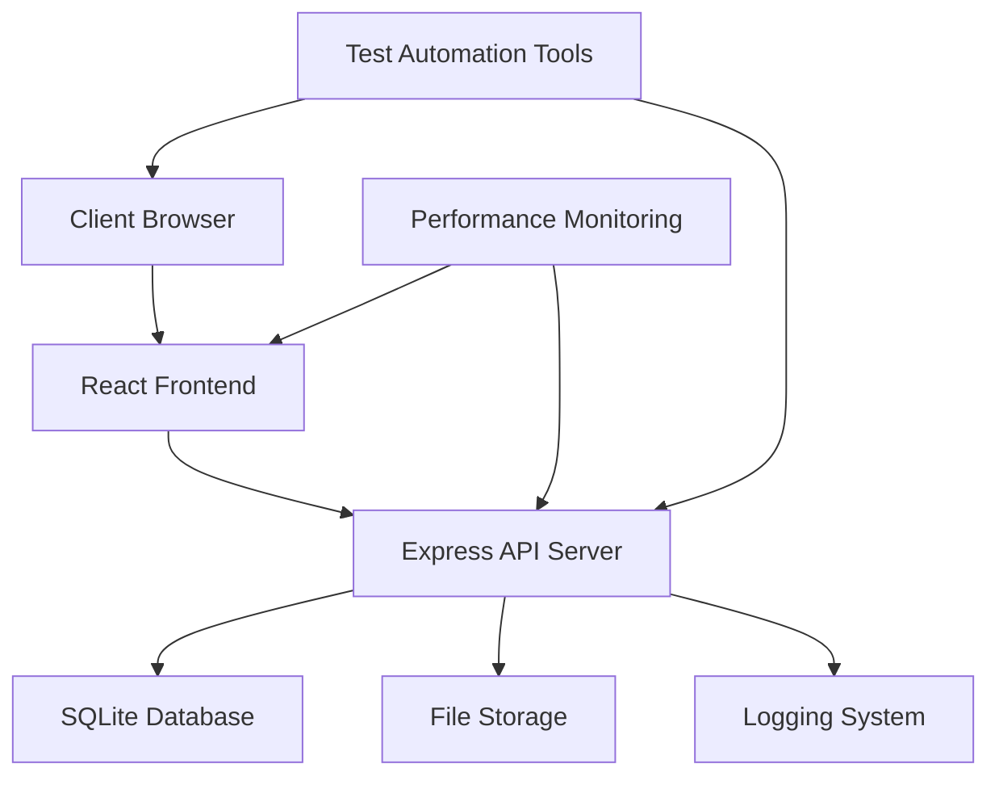

# Design Document

## Overview

The Automation Testing Website is a comprehensive web application designed to provide software testers with a realistic testing environment. The platform will be built using modern web technologies to ensure compatibility with popular automation frameworks while providing extensive testing scenarios across functional, UI, API, and performance testing domains.

## Architecture

### Technology Stack

**Frontend:**

- React 18 with TypeScript for component-based architecture
- Tailwind CSS for responsive styling and theme support
- React Router for client-side navigation
- Axios for API communication
- React Hook Form for form management and validation

**Backend:**

- Node.js with Express.js for RESTful API server
- SQLite for lightweight database operations
- JSON Web Tokens (JWT) for authentication
- Multer for file upload handling
- Winston for logging

**Testing Infrastructure:**

- Jest for unit testing
- Cypress for E2E testing examples
- ESLint and Prettier for code quality

### System Architecture



## Components and Interfaces

### Frontend Components

#### Core Layout Components

- **Header Component**: Navigation menu, user authentication status, theme toggle
- **Footer Component**: Links, copyright, accessibility information
- **Sidebar Component**: Secondary navigation, user profile quick access
- **Layout Wrapper**: Responsive container with breakpoint management

#### Page Components

- **HomePage**: Landing page with dynamic content sections
- **LoginPage**: Authentication form with validation
- **DashboardPage**: User-specific content with role-based access
- **DataTablePage**: Dynamic table with CRUD operations
- **FormsPage**: Collection of various form types for testing
- **APITestingPage**: Interface for API endpoint testing
- **ErrorPages**: 404, 500, and other HTTP error demonstrations

#### Interactive UI Components

- **Modal**: Configurable popup dialogs with various content types
- **Tooltip**: Hover and focus-triggered information displays
- **Accordion**: Expandable content sections
- **Carousel**: Image and content slider with navigation
- **DataTable**: Sortable, filterable, paginated table component
- **FormElements**: Input fields, dropdowns, checkboxes, radio buttons
- **LoadingSpinner**: Async operation indicators
- **NotificationSystem**: Real-time alerts and messages

### Backend API Interfaces

#### Authentication Endpoints

```typescript
POST / api / auth / login;
POST / api / auth / register;
POST / api / auth / logout;
GET / api / auth / profile;
PUT / api / auth / profile;
```

#### User Management Endpoints

```typescript
GET /api/users
POST /api/users
GET /api/users/:id
PUT /api/users/:id
DELETE /api/users/:id
```

#### Data Management Endpoints

```typescript
GET /api/products
POST /api/products
PUT /api/products/:id
DELETE /api/products/:id
GET /api/products/search?q={query}
```

#### File Operations

```typescript
POST /api/files/upload
GET /api/files/:id/download
DELETE /api/files/:id
```

#### Testing Utilities

```typescript
GET /api/test/delay/:ms
GET /api/test/error/:code
POST /api/test/echo
GET /api/test/large-dataset
```

## Data Models

### User Model

```typescript
interface User {
  id: string;
  username: string;
  email: string;
  password: string; // hashed
  role: "admin" | "user" | "guest";
  profile: {
    firstName: string;
    lastName: string;
    avatar?: string;
  };
  createdAt: Date;
  updatedAt: Date;
}
```

### Product Model

```typescript
interface Product {
  id: string;
  name: string;
  description: string;
  price: number;
  category: string;
  inStock: boolean;
  imageUrl?: string;
  tags: string[];
  createdAt: Date;
  updatedAt: Date;
}
```

### Session Model

```typescript
interface Session {
  id: string;
  userId: string;
  token: string;
  expiresAt: Date;
  createdAt: Date;
}
```

### File Model

```typescript
interface FileRecord {
  id: string;
  originalName: string;
  filename: string;
  mimetype: string;
  size: number;
  uploadedBy: string;
  uploadedAt: Date;
}
```

## Error Handling

### Frontend Error Handling

- **Global Error Boundary**: React error boundary to catch and display component errors
- **API Error Interceptor**: Axios interceptor for consistent API error handling
- **Form Validation**: Real-time validation with user-friendly error messages
- **Network Error Handling**: Offline detection and retry mechanisms

### Backend Error Handling

- **Centralized Error Middleware**: Express middleware for consistent error responses
- **Validation Errors**: Input validation with detailed error messages
- **Authentication Errors**: JWT validation and session management errors
- **Database Errors**: SQLite constraint and connection error handling

### HTTP Status Code Implementation

```typescript
// Error response structure
interface ErrorResponse {
  success: false;
  error: {
    code: string;
    message: string;
    details?: any;
  };
  timestamp: string;
}

// Success response structure
interface SuccessResponse<T> {
  success: true;
  data: T;
  timestamp: string;
}
```

## Testing Strategy

### Test Automation Support

#### Element Identification Strategy

- **Unique IDs**: Every interactive element has a unique `id` attribute
- **Data Attributes**: Custom `data-testid` attributes for automation targeting
- **ARIA Labels**: Comprehensive ARIA labeling for accessibility and automation
- **CSS Classes**: Semantic class names following BEM methodology

#### Test Data Management

- **Seed Data**: Predefined test datasets for consistent testing
- **Data Reset Endpoints**: API endpoints to reset test data between test runs
- **Mock Data Generation**: Faker.js integration for generating realistic test data

#### Performance Testing Hooks

- **Large Dataset Pages**: Pages with 1000+ items for load testing
- **Artificial Delays**: Configurable delays for testing timeout scenarios
- **Memory Intensive Operations**: Features that consume significant resources

### Framework Compatibility

#### Selenium WebDriver Support

- Standard HTML elements with proper attributes
- Explicit wait conditions for dynamic content
- Page Object Model friendly structure

#### Cypress Integration

- Custom commands for common operations
- Fixture data for test scenarios
- Network stubbing examples

#### Playwright Compatibility

- Modern JavaScript features support
- Cross-browser testing capabilities
- Mobile viewport testing

## Security Considerations

### Authentication Security

- **Password Hashing**: bcrypt for secure password storage
- **JWT Security**: Short-lived tokens with refresh mechanism
- **Session Management**: Secure session handling with proper cleanup

### Input Validation

- **Server-side Validation**: All inputs validated on the backend
- **SQL Injection Prevention**: Parameterized queries and ORM usage
- **XSS Protection**: Input sanitization and Content Security Policy

### Role-Based Access Control

```typescript
enum Permission {
  READ_USERS = "read:users",
  WRITE_USERS = "write:users",
  DELETE_USERS = "delete:users",
  ADMIN_ACCESS = "admin:access",
}

interface Role {
  name: string;
  permissions: Permission[];
}
```

## Performance Optimization

### Frontend Performance

- **Code Splitting**: React lazy loading for route-based splitting
- **Image Optimization**: WebP format with fallbacks
- **Caching Strategy**: Service worker for static asset caching
- **Bundle Optimization**: Tree shaking and minification

### Backend Performance

- **Database Indexing**: Proper indexes on frequently queried fields
- **Response Caching**: Redis-like caching for expensive operations
- **Rate Limiting**: API rate limiting to prevent abuse
- **Compression**: Gzip compression for API responses

## Accessibility Features

### WCAG 2.1 Compliance

- **Keyboard Navigation**: Full keyboard accessibility
- **Screen Reader Support**: Proper ARIA implementation
- **Color Contrast**: WCAG AA compliant color schemes
- **Focus Management**: Visible focus indicators and logical tab order

### Testing Accessibility

- **Automated Testing**: Integration with axe-core for accessibility testing
- **Manual Testing Guidelines**: Documentation for manual accessibility testing
- **Keyboard Testing Scenarios**: Predefined keyboard navigation test cases

## Responsive Design

### Breakpoint Strategy

```css
/* Mobile First Approach */
@media (min-width: 640px) {
  /* sm */
}
@media (min-width: 768px) {
  /* md */
}
@media (min-width: 1024px) {
  /* lg */
}
@media (min-width: 1280px) {
  /* xl */
}
```

### Component Responsiveness

- **Flexible Grid System**: CSS Grid and Flexbox for layout
- **Responsive Typography**: Fluid typography scaling
- **Touch-Friendly Interfaces**: Appropriate touch targets for mobile
- **Progressive Enhancement**: Core functionality works without JavaScript

## Development and Deployment

### Development Environment

- **Hot Reloading**: Development server with live reload
- **Environment Variables**: Configuration management for different environments
- **Docker Support**: Containerized development environment
- **Database Migrations**: Version-controlled database schema changes

### Build Process

- **Automated Building**: CI/CD pipeline for automated builds
- **Testing Integration**: Automated test execution in build process
- **Code Quality Checks**: ESLint, Prettier, and TypeScript checks
- **Security Scanning**: Dependency vulnerability scanning

### Documentation

- **API Documentation**: OpenAPI/Swagger documentation
- **Component Documentation**: Storybook for UI component documentation
- **Testing Guidelines**: Comprehensive testing documentation
- **Setup Instructions**: Step-by-step development environment setup
